# Patika & NewMind AI Homework

## Project Overview
This assignment, based on the dataset provided by our instructor **Burak Polater** during the **Patika & NewMind AI Bootcamp**, aims to enhance our learning. The objective is to apply data analysis, processing, and machine learning techniques taught in the bootcamp to reinforce our understanding.

The assignment consists of the following tasks:
- **Task 1: Data Cleaning and Processing (25%)**
- **Task 2: Time Series Analysis (25%)**
- **Task 3: Categorical and Numerical Analysis (25%)**
- **Task 4: Advanced Data Manipulation (25%)**
- **Task 5: Additional (BONUS)**

## Technology and Environment Setup
The project is coded in Python. You can find the modules used in the requirements.txt file.
- After creating a virtual environment (e.g., **Anaconda**, **virtualenv**, etc.) on your computer, you can set up your environment by running:
`pip install -r requirements.txt`

## Datasets
The datasets used in this project can be found in the project repository. These datasets are as follows:
- **Customer Data**  
- **Sales Data**
Both datasets were created by our instructor, **Burak Polater**, and are intended solely for educational purposes.

## Sales Data
This dataset contains information about the sales of different products, with each row representing a different sale.

- **tarih**: The date the sale took place.
- **ürün_kodu**: A unique identifier for the sold product.
- **ürün_adi**: The name of the sold product.
- **kategori**: The category or group the product belongs to.
- **fiyat**: The unit sale price of the product.
- **adet**: The quantity of the product sold.
- **toplam_satis**: The total sales amount, calculated by multiplying the quantity sold by the price.

## Customer Data
Contains data related to customers.

- **musteri_id**: A unique identifier assigned to each customer.
- **isim**: The first or last name of the customer.
- **cinsiyet**: The gender of the customer (e.g., Male/Female).
- **yas**: The age of the customer.
- **sehir**: The city where the customer resides.
- **harcama_miktari**: The total amount spent by the customer.

## Task Document
The task details and requirements are documented in the Ödev - Veri Analizi ve Manipülasyonu.docx.pdf file, which can be found in the project directory.

### Task 1: Data Cleaning and Processing
In this section, two datasets—sales_df (sales data) and customer_df (customer data)—were analyzed. The data cleaning and processing procedures were performed as follows:

#### 1.1 Analyze and clean the missing and outlier data

First, both datasets were loaded from CSV files, and the first few rows of the data were displayed:
- **Sales Data**: `sData`
- **Customer Data**: `cData`

To ensure the original data is not lost, a copy of the DataFrame was created using `copy.deepcopy`. The `head()` and `tail()` functions were used to examine the first and last few rows of the dataset, while `shape()` provided information about the dimensions of the data. The `columns()` function listed all column names, and `isnull().sum()` was used to identify missing values. To understand the data types of each column, `dtypes()` was employed, and `describe()` provided summary statistics. The `unique()` function was used to check for unique values in the columns, and `duplicated().any()` was used to check for any duplicate entries.

- **Missing Value Handling**:
    - The `isnull().sum()` method was used, and it was observed that there were no missing values. However, upon closer inspection of the data, it was found that the price column contained incorrect values.

        - Since the `fiyat` column is calculated by dividing `toplam_satis` by `adet`, the `toplam_satis` column, initially of type object, was converted to numeric. Then, the `fiyat` column was recalculated based on the mathematical operation.

#### **1.2. Outlier Detection**

To identify the outliers in the numeric columns `fiyat`, `toplam_satis`, `harcama_miktari`, and `adet`, **scatterplots** and **boxplots** were plotted, as shown in the following graph.

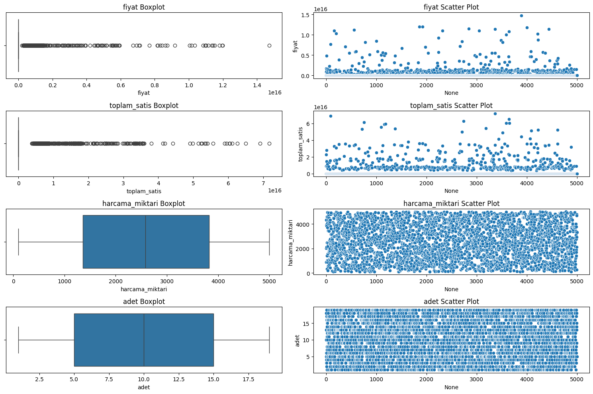

The outliers are clearly visible in the `fiyat` and `toplam_satis` graphs, while the `harcama_miktari` and `adet` columns show a **uniform distribution**.

- The values that appear as outliers in the `toplam_satis` column are incorrect; the column was recalculated as `adet` multiplied by `fiyat`. Then, I used quantiles to remove the outliers.

- Since there is a significant difference between the prices of `elektronik` products and `kırtasiye` items, the price column was visualized again by category, as shown in the following graph. 

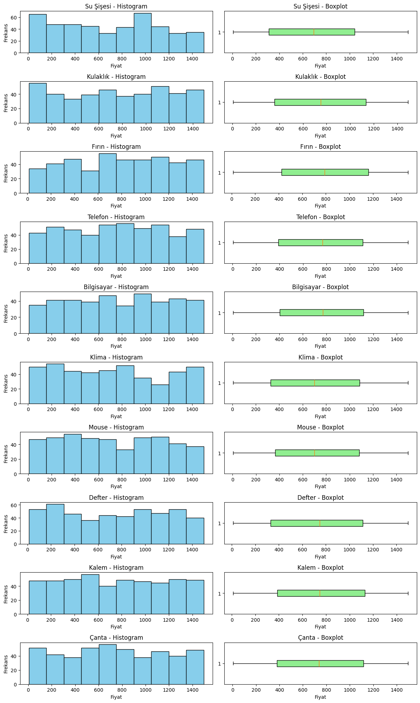

    - Since the products within each category displayed a **uniform distribution**, I did not make any changes to those columns.

#### **1.3. Merging Data**

The **Sales Data** and **Customer** Data were combined based on the `musteri_id` column, ensuring each sales record was linked to the corresponding customer information. The merged dataset, `merged_df`, was created, and a sample of the data was displayed. It was also saved as `merged_data.csv` in the repository folder.

### Task 2: Time Series Analysis

This section focuses on analyzing the sales data over time, exploring trends and patterns at both weekly and monthly intervals. The analysis was broken down into several parts, as described below.

#### **2.1. Analyze Total Sales and Product Sales Trends on a Weekly and Monthly Basis**

This task involves analyzing the total sales and product sales trends on a weekly and monthly basis within the sales data.

##### **2.1.1 Weekly Sales Analysis**

- The `tarih` column was converted to a datetime type using `pd.to_datetime`.

- A new column called `hafta` was created using `.dt.to_period("W").astype(str)` to represent the week of each sale.

- The total `toplam_satis` values were calculated by week using the `groupby()` method, as shown in the following graph. 

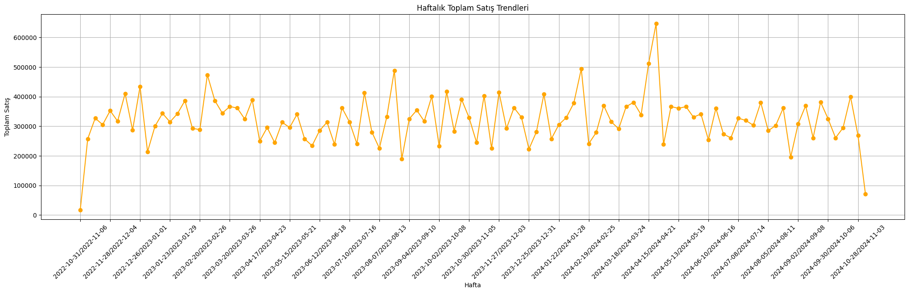 

- The total values were calculated by `urun_adı` on a weekly basis using `groupby()` method, as shown in the following graph.

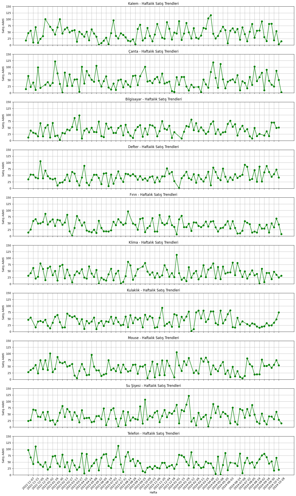 

##### **2.1.1 Weekly Sales Analysis**

- A new column called `ay` was created using `.dt.to_period("M").astype(str)` to represent the week of each sale.

- The total `toplam_satis` values were calculated by month using the `groupby()` method, as shown in the following graph. 

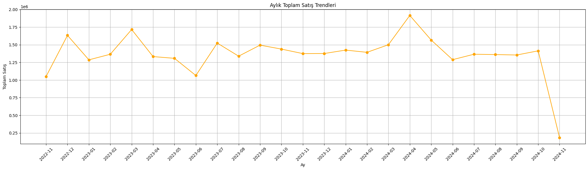 

- The total values were calculated by `urun_adı` on a monthly basis using `groupby()` method, as shown in the following graph.

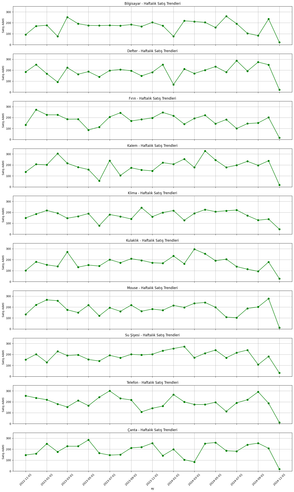 

#### **2.2. Identify the first and last sales days of each month and calculate weekly product sales**

#### **2.2.1 Monthly First and Last Days**

- After grouping the data by month using `groupby(df['tarih'].dt.to_period('M'))`, the first and last sales days of each month were determined using the `min()` and `max()` methods, respectively.

#### **Weekly Total Product Sales**

- The previously created "hafta" column was used to group the data, and the total values were calculated based on the "adet" column, as shown in the following graph.

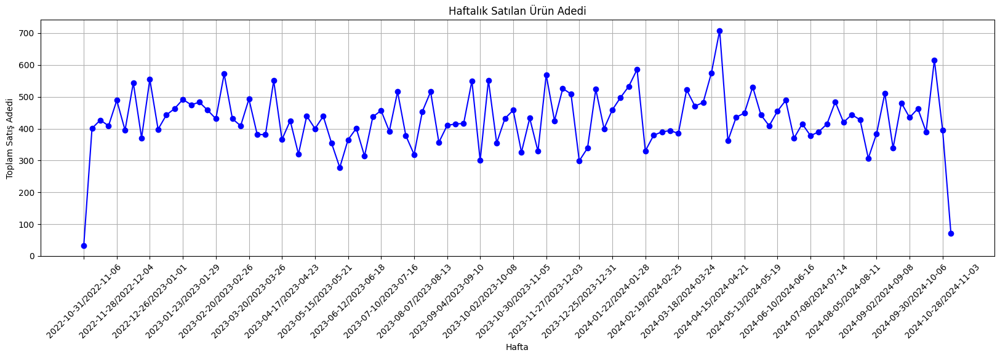 

### Task 3: Categorical and Numerical Analysis

This section focuses on analyzing total sales and their proportions by product category, examining sales trends across customer age groups, and comparing spending behaviors between male and female customers.

#### **3.1 Analyze Sales by Category**

The total sales for each product category were calculated using the `groupby()` method on the `kategori` column, summing the values in the `toplam_satis` column. The overall total sales amount was then computed using the sum method. Finally, the proportion of each category within the total sales was determined by dividing each category's sales by the overall total and multiplying by 100, with the results stored in a new column. The graph illustrating this analysis can be seen below.

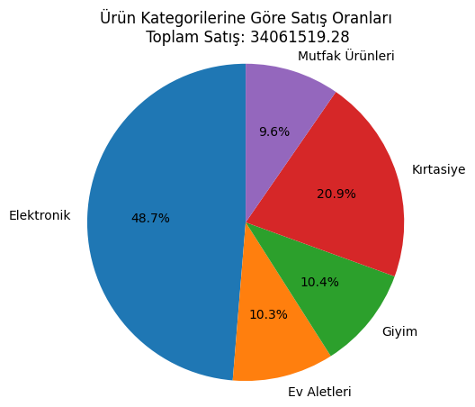

#### **3.2 Age Group Analysis**

Customer age groups were defined (`18-25`, `26-35`, `36-50`, `50+`) by creating a new column based on the `yas` column using conditional statements or the `pd.cut()` method. The data was then grouped by these age groups using the `groupby()` method, and sales data was aggregated to analyze total sales and spending patterns, revealing trends in purchasing behavior across different age ranges. The graph illustrating this analysis can be seen below.

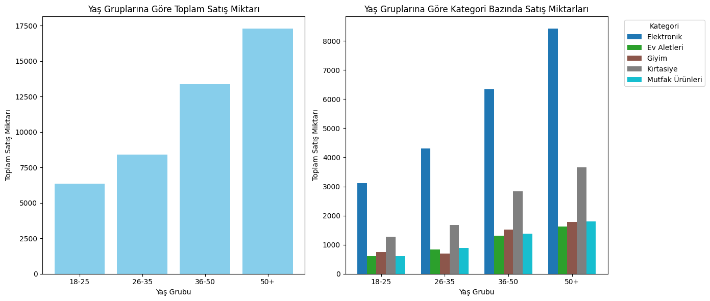

#### **3.3 Gender Analysis**

Spending amounts were calculated by grouping the data by both `kategori` and `cinsiyet` columns using the `groupby()` method and summing the `harcama_miktari` values. A bar chart was then created to visualize the spending distribution across categories and genders. Unique categories and genders were extracted, and a nested loop was used to plot the spending data for each gender within each category, with different colors representing categories and grouped bars for gender comparisons, as shown in the following graph.

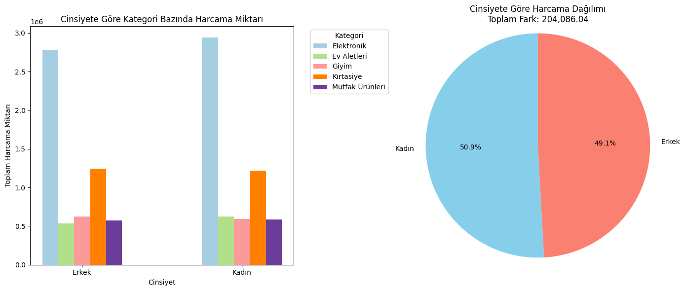

### Task 4: Advanced Data Manipulation

This section focuses on advanced data manipulation, including calculating total spending by city and ranking cities based on high-spending customers, analyzing the monthly sales growth rates for individual products, and using groupby to compute and visualize the monthly sales trends and change rates for each category.

#### **4.1 Spending Analysis by City**

##### **4.1.1 Total Spending Analysis by City**

Total spending by city was calculated using the `groupby()` method on the `sehir` column and summing the `harcama_miktari` values. The resulting data was then sorted in descending order based on the total spending using the `sort_values()` method to rank the cities by their spending amounts. The graph illustrating this analysis can be seen below.

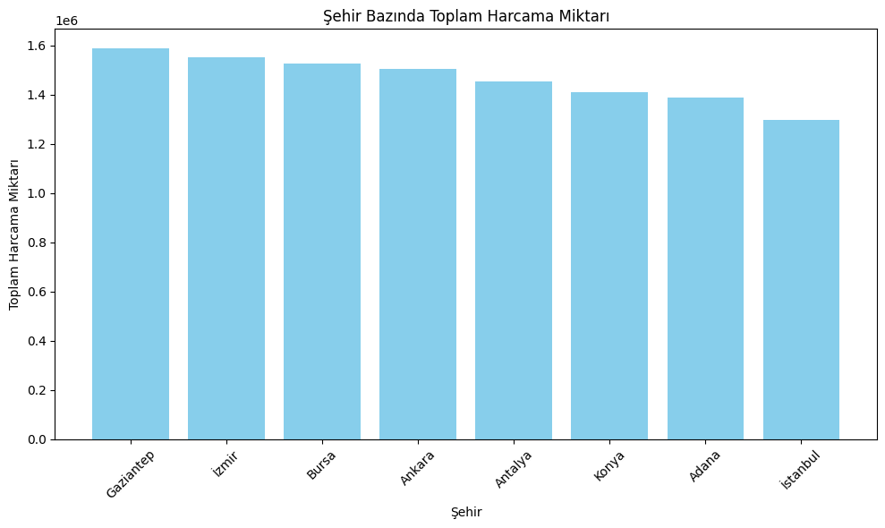

##### **4.1.2 Customer and City Expenditure Data**

Customer spending by city was calculated by grouping the data using the `musteri_id` and `sehir` columns, then summing the `harcama_miktari` values. The customer ID with the highest spending for each city was determined using `idxmax()` on the grouped data. The maximum spending per city was then calculated using `max()` and sorted in descending order to identify the cities with the highest individual customer spending. The graph illustrating this analysis can be seen below.

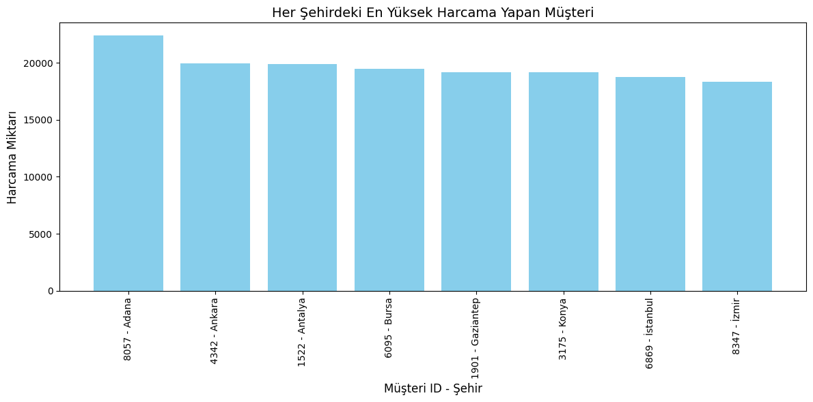

#### **4.2: Calculate the Average Sales Growth Rate for Each Product**

Sales data was grouped by month using the `tarih` column, and the total sales for each product were calculated by summing the `adet` values using `groupby()`. The data was then sorted by `ürün_adi` and `ay` for further analysis. To calculate the sales growth percentage for each product, a loop iterated over the products, comparing sales between consecutive months. The percentage change in sales was calculated using the formula `((current month sales - previous month sales) / previous month sales) * 100`, 

#### **4.3: Monthly Sales and Changes by Category**

The sales data was grouped by `kategori` and `ay` columns to calculate the total sales for each category per month using `groupby()`. The data was then sorted by `kategori` and `ay` for clarity. To calculate the sales difference, the `diff()` method was applied within each category, computing the difference in sales between the current month and the previous month. The graph illustrating this analysis can be seen below.

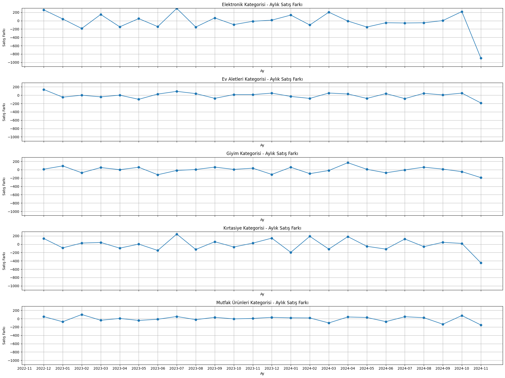 

### Task 5: Additional (BONUS)

This section involves advanced analysis techniques, starting with **Pareto Analysis** to apply the 80/20 rule, identifying products that contribute to 80% of total sales, and visualizing these products. **Cohort Analysis** is then performed to examine customer purchase behavior, such as analyzing the repurchase rate of first-time buyers. Finally, a **Prediction Model** is created using a simple linear regression model in sklearn to forecast monthly or weekly sales, with model evaluation based on accuracy after training and testing.

#### **5.1: Pareto Analysis (80/20 Rule)**

In this analysis, the total sales of each product are calculated by grouping the data by `ürün_adi` and summing the `adet` values. The results are sorted in descending order based on sales volume. Cumulative sales and the cumulative percentage of total sales are then calculated to identify which products contribute to the top 80% of sales, following the Pareto principle. Finally, products that account for the first 80% of sales are selected using a cumulative percentage threshold of 0.80, representing the key products for **Pareto analysis**. The graph illustrating this analysis can be seen below.

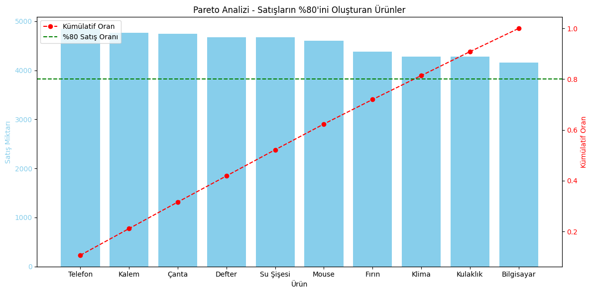 

#### **5.2: Cohort Analysis**

In this **cohort analysis**, the first purchase date of each customer is identified by grouping the data by `musteri_id` and using the `min()` function on the `tarih` column. This first purchase date is then merged with the original data, creating a new dataset that includes both the customer's first purchase date and the individual sale dates. The cohort month for each customer is determined by extracting the period of the first purchase date, while the sale month is derived from the transaction date. The data is grouped by both the cohort month and the sale month, and the number of unique customers (`musteri_id`) in each group is calculated. The number of active customers is recorded, and the number of months elapsed since the first purchase is calculated by subtracting the cohort month from the sale month , as shown in the following graph.

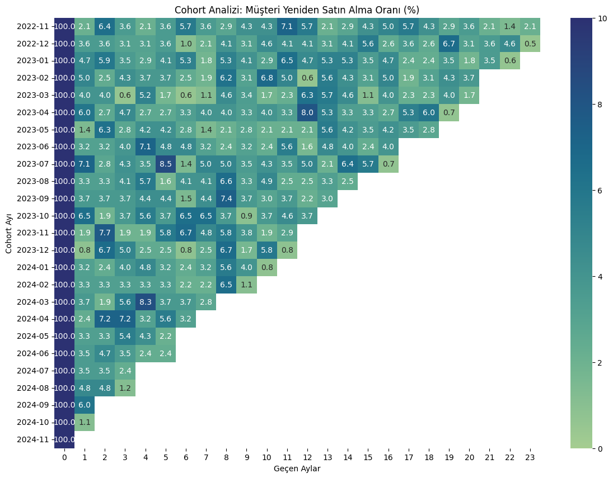 

#### **5.3: Basic Regression Model**

In this analysis, weekly sales data was created by first selecting the relevant columns (`tarih` and `toplam_satis`) and creating a copy of the original dataframe. The `tarih` column was converted to a weekly period using `dt.to_period('W')`, creating a new `hafta` column. The weekly sales were calculated by grouping the data by the hafta column and summing the `toplam_satis` values. A numerical representation of the weeks (`hafta_num`) was generated for modeling purposes.

The features (`X`) and target (`y`) variables were separated, with hafta_num as the feature and `toplam_satis` as the target. The dataset was split into training and testing sets using an 80/20 split. A linear regression model was then created and trained on the training data. The model's predictions were made on the test data, and the performance of the model was evaluated using Mean Squared

The scatter plot below shows the relationship between the predicted values (`yPred`) and the actual test values (`yTest`).

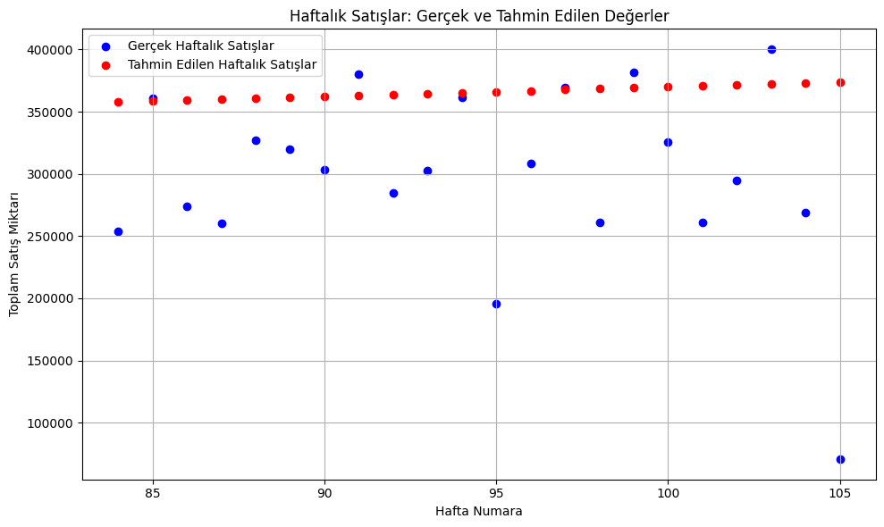 

## Conclusion

This analysis provided in-depth insights into various critical aspects of the company's sales performance, customer behavior, and product performance. A thorough examination of sales data based on different cities revealed a number of key cities that are driving a substantial portion of the overall revenue. Identifying these high-revenue cities is instrumental for making informed decisions regarding targeted marketing campaigns and optimal resource allocation, ensuring that efforts are directed where they will have the greatest impact.

Furthermore, by analyzing customer spending patterns at the city level, we were able to gain a deeper understanding of which customer segments are the most profitable. This allowed for the identification of key demographics and spending behaviors that can be targeted with personalized marketing strategies, which could potentially maximize the return on marketing investments and improve customer engagement.

In addition to customer-level analysis, examining the sales growth on a monthly basis for each product revealed important trends that could guide both inventory management and promotional decisions. Identifying products with consistent growth allowed us to forecast demand and plan for the most efficient allocation of resources. Moreover, tracking sales trends by product category provided valuable insights into which product lines were experiencing growth or decline, aiding in strategic decisions regarding product development, inventory planning, and future product offerings.

A Pareto analysis was also conducted, which revealed that a small subset of products contributed disproportionately to the overall sales volume. This finding highlights the importance of focusing efforts on optimizing and promoting these high-performing products, as they have the potential to generate significant revenue with relatively fewer resources.

The cohort analysis, which tracked customer behavior from their first purchase, provided a critical perspective on customer retention rates and repurchase patterns. This type of analysis is key for understanding the customer lifecycle and could directly inform strategies aimed at improving customer loyalty, retention, and repeat purchases. By understanding how long customers typically stay engaged with the company and their buying behaviors over time, more effective retention campaigns could be developed.

Lastly, a regression model was used to predict future sales, providing a forward-looking perspective based on historical data. The results were promising, indicating some reliable trends, although there is room for improvement. By incorporating additional variables such as marketing spend, seasonality, and customer behavior metrics, the model could potentially be enhanced to provide more accurate forecasts, thus supporting more informed decision-making.

Taken together, these comprehensive insights offer a clear path for refining the company’s marketing, sales, and customer engagement strategies. By leveraging these data-driven findings, the company can make more targeted decisions that optimize resources, enhance customer satisfaction, and drive revenue growth.

